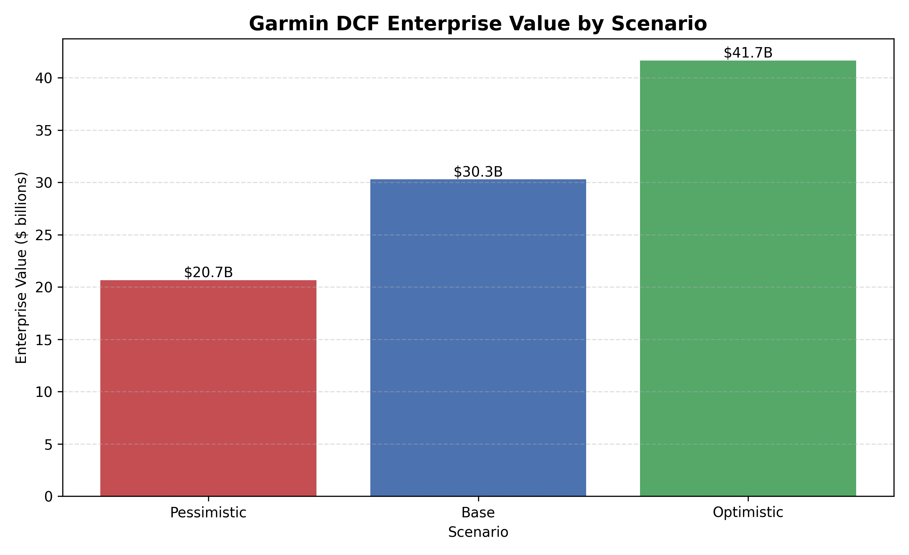
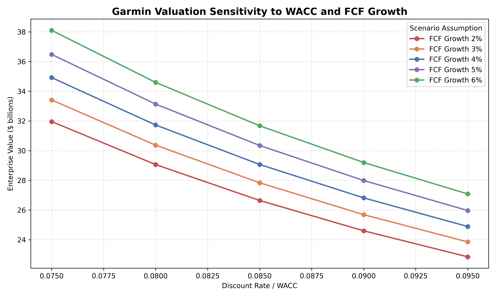

# Automated Financial Analysis Toolkit

## Project Overview

This project is a Python-based financial analysis toolkit built using Garmin Ltd. as a case study. The toolkit automates financial ratio analysis, CAPM cost of equity calculation, WACC estimation, DCF valuation, scenario analysis, sensitivity analysis, and analyst-style summary generation.

The project supports my positioning as an AI-enhanced Finance & ESG Analyst by combining financial analysis, market data, ESG-related company research, and Python automation.

## Key Features

- Calculates financial ratios including ROA, ROE, debt ratio, and interest coverage
- Estimates cost of equity using CAPM
- Calculates WACC using cost of equity, cost of debt, tax rate, and capital structure assumptions
- Builds a simplified DCF valuation model
- Performs pessimistic, base, and optimistic scenario analysis
- Creates sensitivity analysis charts for WACC and FCF growth assumptions
- Generates an analyst-style financial summary

## Finance Concepts Used

- Ratio Analysis
- CAPM
- WACC
- DCF Valuation
- Scenario Analysis
- Sensitivity Analysis
- ESG disclosure review

## Data Sources

- Garmin annual reports
- Garmin Corporate Impact Report
- FRED 10-year Treasury yield
- Yahoo Finance GRMN beta
- Damodaran implied equity risk premium
- S&P Global ESG reference
- Garmin capital structure case materials

## Tools Used

- Python
- pandas
- matplotlib
- CSV files
- Financial statement data
- Market data assumptions

## Project Structure
```text
automated-financial-analysis-toolkit/
├── data/
│   ├── garmin_financials_template.csv
│   └── market_assumptions.csv
├── src/
│   ├── ratios.py
│   ├── capm.py
│   ├── wacc.py
│   ├── dcf.py
│   ├── scenario_analysis.py
│   ├── sensitivity_analysis.py
│   └── summary_generator.py
├── outputs/
│   ├── ratio_analysis_results.csv
│   ├── valuation_summary.csv
│   ├── scenario_analysis_results.csv
│   ├── scenario_chart.png
│   ├── sensitivity_chart.png
│   └── analyst_summary.txt
├── main.py
└── README.md
```

## Sample Visual Outputs





## Key Results
Cost of Equity: 9.15%
WACC: 8.26%
Base-case DCF Enterprise Value: approximately $30.29 billion
Pessimistic scenario value: approximately $20.7 billion
Optimistic scenario value: approximately $41.7 billion

## Analyst Summary
The toolkit suggests that Garmin demonstrates strong profitability, conservative leverage, and meaningful valuation sensitivity to growth and discount rate assumptions. This analysis is intended as a simplified financial modelling exercise rather than a full investment recommendation.

## Skills Demonstrated
Financial modelling
Python automation
Data cleaning and CSV-based input design
Valuation analysis
Scenario and sensitivity analysis
Analyst-style business communication
ESG-aware company research

## Analysis Workflow

1. Collected Garmin financial statement data, market assumptions, and ESG-related reference materials.
2. Designed CSV input templates for company financials and market assumptions.
3. Built a financial ratio module to calculate ROA, ROE, debt ratio, and interest coverage.
4. Built a CAPM module to estimate Garmin's cost of equity.
5. Built a WACC module using cost of equity, cost of debt, tax rate, and capital structure assumptions.
6. Built a simplified DCF model using projected free cash flows, WACC, and terminal growth.
7. Created pessimistic, base, and optimistic valuation scenarios.
8. Created sensitivity analysis charts to show how enterprise value changes under different WACC and FCF growth assumptions.
9. Generated analyst-style output tables and a written financial summary.
10. Integrated all modules into a single `main.py` workflow that produces CSV outputs, charts, and a summary file.